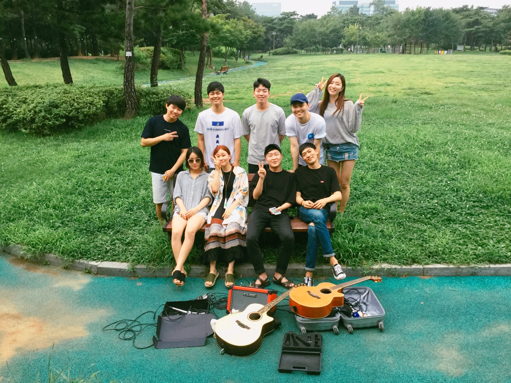

# MOntmartre Music Festival (MOMF)

## This is Montmartre Music Festival github's page

MOntmartre Music Festival have a very simple purpose that music make happy people.

## 개발일지

## 12.7

1. TTF(windows), OTF(macos)
2. change project divider svg file
3. icon fontr

## 12.10

- font-icon 사용

## 12.11

- mouseOver Event 에러 발견 버튼위에서 커서가 움직일시 무한으로 발생한다. => mouseEnter, mouseLeave로 해결
- 요소 한개한개 마다 over시에 underline을 추가하고 싶음
- Refactoring을 하면서 개발을 하고 싶으나 손보고 싶은 데가 너무 많으므로 개발완료 후에 유지보수하면서 진행해보도록하자.
- Gitflow전략을 통해서 혼자서도 협업 전략을 유지하면서 진행해 보도록 하겠다.(중간 단계부터 develop branch 을 통해 push시작) => 혼자서 gitflow를 지키다보니 굉장히 불편하고 꼬인다. 혼자서는 진행할 때 기본적인 것만 유지하도록 하자.
- 모바일 버전도 개발해야된다 젠장할!! => 개발완료 but 가운데 정렬 이슈 잔존

## 12.31

모바일 버전 중앙정렬 완료 1.0 v까지 남은 것은 내용 채워넣기 및 동영상 넣기

- 현재 firebase이용해서 deploy완료상황
- 0.5 버전 개발 완료 후 릴리즈
- 모바일 버전 0.9 배포 완료

### 남은 것

- 원하는 메뉴에 마우스 올릴시 underline추가

made by dongwon gim

[추가 개발사항](./Readme/addition.md)
