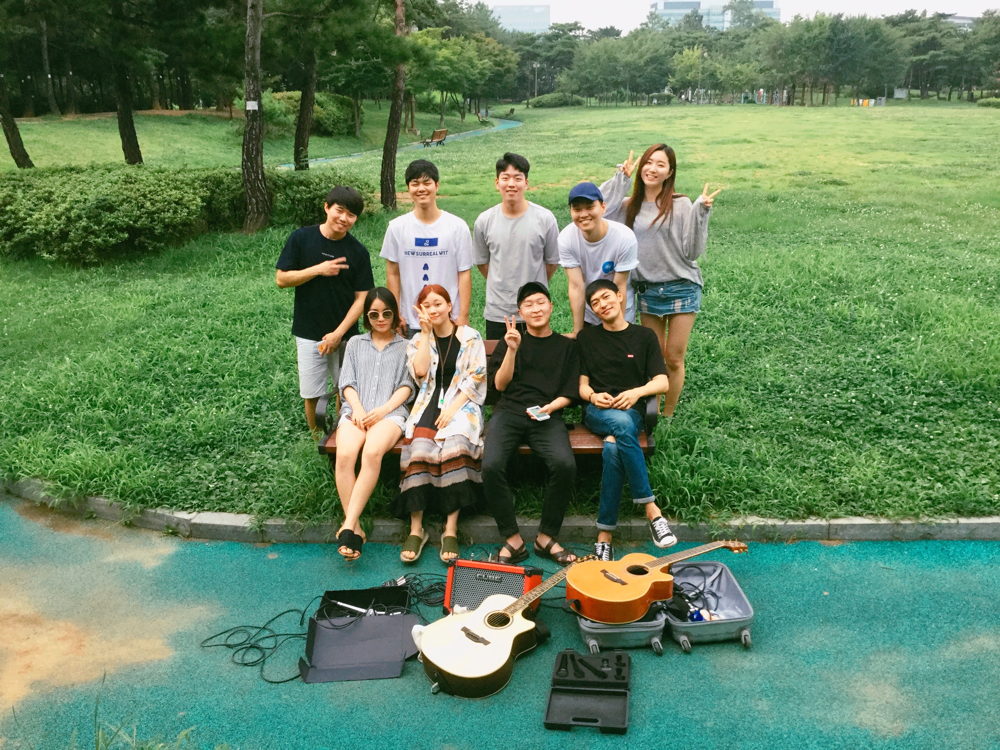

# MOntmartre Music Festival (MOMF)

## This is Montmartre Music Festival github's page

MOntmartre Music Festival have a very simple purpose that music make happy people.

## 개발일지

12.7

1. TTF(windows), OTF(macos)
2. change project divider svg file
3. icon fontr

   12.10

4. font-icon 사용

   12.11

5. mouseOver Event 에러 발견 버튼위에서 커서가 움직일시 무한으로 발생한다. => mouseEnter, mouseLeave로 해결
6. 요소 한개한개 마다 over시에 underline을 추가하고 싶음
7. Refactoring을 하면서 개발을 하고 싶으나 손보고 싶은 데가 너무 많으므로 개발완료 후에 유지보수하면서 진행해보도록하자.

made by dongwon gim
